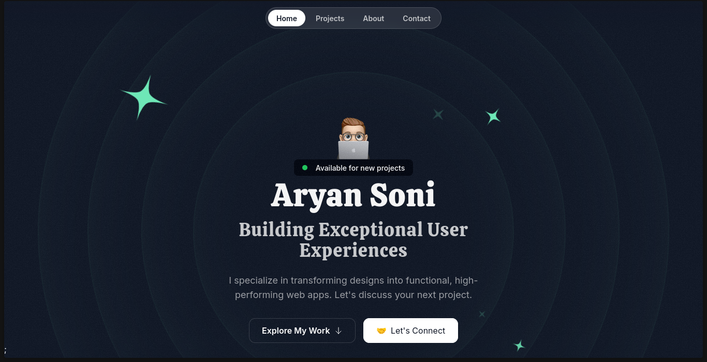

# Personal Portfolio

A modern, responsive, and beautifully animated developer portfolio website built with **Next.js**, **React**, **Tailwind CSS**, and **Framer Motion**.



## 🚀 Features

- **Modern Tech Stack**: Built with Next.js 14 App Router and React 18.
- **Beautiful Animations**: Smooth scrolling and entry animations powered by Framer Motion.
- **Fully Responsive**: Optimized for seamless viewing on edge-to-edge mobile, tablet, and desktop displays using Tailwind CSS.
- **Modular Components**: Clean architecture with logically separated UI components and layout sections (Hero, About, Projects, Testimonials, Contact, Tape etc.).
- **Interactive UI elements**: Rotating orbits, animated tape banners, toolbox items, and immersive backgrounds elements.

## 🛠️ Tech Stack

- **Framework**: [Next.js](https://nextjs.org/) (App Directory)
- **Library**: [React.js](https://reactjs.org/)
- **Styling**: [Tailwind CSS](https://tailwindcss.com/)
- **Animations**: [Framer Motion](https://www.framer.com/motion/)
- **Icons**: SVGR / Custom SVG Assets
- **Type Checking**: [TypeScript](https://www.typescriptlang.org/)

## 📂 Project Structure

```text
src/
├── app/               # Next.js App Router root layout & globals
├── assets/            # Static assets (images, icons)
├── components/        # Reusable UI components (Cards, Orbit elements, Badges)
│   ├── Card.tsx
│   ├── HeroOrbit.tsx
│   ├── ToolboxItems.tsx
│   └── ...
└── sections/          # Major landing page sections
    ├── Hero.tsx
    ├── About.tsx
    ├── Projects.tsx
    ├── Testimonials.tsx
    ├── Contact.tsx
    ├── Tape.tsx
    └── ...
```

<!-- ## ⚠️ Copyright & Usage Notice

**This is not an open-source project.** The codebase, design, and assets are private. You are not permitted to clone, copy, modify, distribute, or use this code for your own projects.

## 💻 Local Development (Authorized Only)

### Prerequisites

Ensure you have [Node.js](https://nodejs.org/) (version 18+ recommended) and `npm` installed.

### Running Locally

1. **Install dependencies:**
   ```bash
   npm install
   ```

3. **Start the development server:**
   ```bash
   npm run dev
   ```

4. Open [http://localhost:3000](http://localhost:3000) in your browser to see the portfolio. -->


<!-- ## 📝 Editing the content

- Modify the main structure inside `src/app/page.tsx` and `src/app/layout.tsx`.
- Modify individual sections (such as update about details or projects data) inside the respective files in `src/sections/`.
- Styling configuration is located in `tailwind.config.ts`.

## 📄 License

**All rights reserved.** This project is proprietary and closed-source. No license is granted for use, reproduction, or distribution.


## Deploy on Vercel

The easiest way to deploy your Next.js app is to use the [Vercel Platform](https://vercel.com/new?utm_medium=default-template&filter=next.js&utm_source=create-next-app&utm_campaign=create-next-app-readme) from the creators of Next.js.

Check out our [Next.js deployment documentation](https://nextjs.org/docs/deployment) for more details. -->
